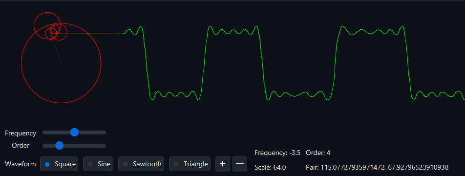

# FourierFX

FourierFX is a [JavaFX](https://openjfx.io/) application that visualizes [Fourier series](https://math.mit.edu/~gs/cse/websections/cse41.pdf).
It allows users to select different waveforms and adjust the frequency and order of the Fourier series.

## Features

- Selection of different waveforms: Square, Sine, Sawtooth, Triangle
- Adjustable frequency and order of the Fourier series
- Scale adjustment
- Debug mode to visualize the individual terms of the Fourier series

## Preview



## Requirements

- Java 21
- JavaFX 21
- Maven

## Building

To build the project, use the following Maven command:

```bash
mvn clean install
```

## Running

To run the project, use the following Maven command:

```bash
mvn javafx:run
```

## Contributing

Pull requests are welcome. For major changes, please open an issue first to discuss what you would like to change.

If you find this project helpful, please consider giving it a ⭐️.

## License

This project is licensed under the MIT License—see the [LICENSE](LICENSE) file for details.